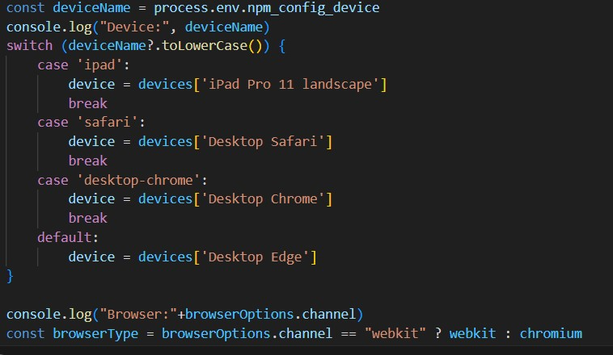
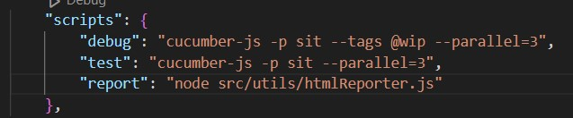
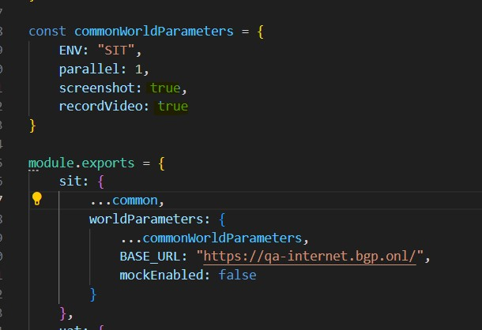
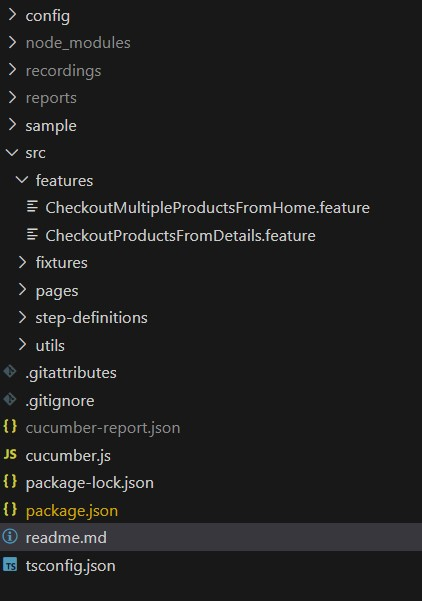

<head><meta name="google-site-verification" content="ENexGkY76qw03xJfdk07MafDDoHUrot0ECv2uHval2w" /></head>

<h1 dir="auto"><a class="anchor" aria-hidden="true" href="<https://playwright.dev/>"><svg class="octicon octicon-link" viewBox="0 0 16 16" version="1.1" width="16" height="16" aria-hidden="true"><path fill-rule="evenodd"></path></svg></a><g-emoji class="g-emoji" alias="performing_arts" fallback-src="<https://github.githubassets.com/images/icons/emoji/unicode/1f3ad.png>">🎭</g-emoji> Automation framework in Playwright with Cucumber</h1>

<p align="center">
\#automation #playwright #typescript #boilerplate #starter-repo
</p>

A starter repo for writing E2E tests with Playwright and Cucumber framework using Typescript.

<!-- TABLE OF CONTENTS --> <details open="open"> <summary>Table of Contents</summary> <ol> <li> <a href="#about-the-automation-framework">About The Automation Framework </a> <ul> <li><a href="#built-with">Built With</a></li> </ul> </li> <li> <a href="#getting-started">Getting Started</a> <ul> <li><a href="#prerequisites">Prerequisites</a></li> </ul> </li> <li><a href=“#to-execute-automation”>To execute Automation</a>

<ul> <li><a href="#executes-all-scenarios">Executes ALL scenarios</a></li> </ul><ul> <li><a href="#Executes-SPECIFIC-Scenarios">Executes SPECIFIC scenarios</a></li> </ul><ul> <li><a href="#Generate-HTML-reports">Generate HTML reports</a></li> </ul> </li>

</li> <li><a href="#Automation-report">Automation report</a></li></li> <li><a href="#Framework-folder-structure">Framework folder structure</a></li></li> <li><a href="#pros-and-cons">Pros and Cons</a></li>

</ol>
</details>

## About The Automation Framework

* **Playwright** with **TypeScript** and integrated **Cucumber** **BDD framework**.
* Followed **Page Object Model (POM)** to organize pages, locators, and interaction methods in same class.
* Adopted **[BDD Declarative format](https://cucumber.io/docs/bdd/better-gherkin/)**, making steps concise, readable, and understandable for non-developers. Thus, minimized steps by combining input and click events into declarative statements.

### Built With

* [Playwright](https://playwright.dev/)

  Cross-Browser, Cross-Platform and Cross-Language support. Lot of device emulators options to run tests on different viewports.
* [Cucumber](https://cucumber.io/)

  
  1. Improved Collaboration:  By writing test scenarios in plain language, Cucumber bridges the gap between business and development teams. Everyone can contribute to the test cases, ensuring better alignment on requirements.
  2. Reusable Test Steps: Steps written in Cucumber scenarios (like "Given," "When," "Then") can be reused across multiple scenarios, reducing duplication and increasing efficiency.
  3. Integration with Automation Tools: Cucumber integrates seamlessly with popular testing tools and libraries (like Cypress, Selenium, Appium, RestAssured) to automate end-to-end testing for web, mobile, and APIs.
  4. Supports Multiple Languages: Cucumber is available in many programming languages (Java, Ruby, Python, JavaScript, etc.), making it flexible and suitable for diverse tech stacks.
  5. Provides hooks like @BeforeAll,@AfterAll, @BeforeStep, @AfterStep, @Before(order = 2)etc. which helps in easy setup and teardown after each scenarios run.
* Typescript

  TypeScript allows you to define data types (e.g., `string`, `number`, `boolean`, `array`, `object`) explicitly for variables, function parameters, and return values. Thus, catches type-related bugs and logic errors during compilation.

## Getting Started

Clone the repository and import the project in your preferred IDE.

### Prerequisites

* [Nodejs](https://nodejs.org/en/learn/getting-started/how-to-install-nodejs) v18+

  *Set the node path in Environment variables.*
* Open terminal in IDE, and run ***npm i*** or ***npm install***

  *This will download all the dependencies mentioned in package.json*

## To execute Automation

After setting up the project, open terminal(command prompt)

### __Executes ALL Scenarios:__

Runs all scenarios in all feature files

***npm run test***  (bydefault runs on Chrome browser and Device as ‘Desktop Chrome’)

***npm run test --device=desktop-edge --browserName=msedge***

***npm run test --device=safari --browserName=webkit***

note: hooks.ts file has all available devices that has been configured and can be passed as params in cli.



### __Executes SPECIFIC Scenarios:__

Runs scenarios where @debug is present either at feature or scenario level

Add @debug tag and run following command

*npm run debug*

### __Generate HTML reports:__

*npm run report*

note: package.json file has all available scripts



## Automation report

3 types of reports has been configured:

* cucumber.js (generated by cucumber framework)
* html (cucumber-html-formatter helps in creating html report from .json)
* recording \*.webm (video recording of scenarios executed. This can be further converted to .mp4 format by using external lib)

Bydefault screenshot and recordVideo is set to true which can be set as false in cucumber.js



### Sample Automation report:

*note: Screenshots are set as full-page so tool will scroll and take screenshot. This can be set to false.*

```
 HTML: ./sample/cucumber_report.html

 Video: ./sample/multipleAtOnce.webm
 Video: ./sample/individualProducts.webm
```

## Framework folder structure:

Folder structure is quite simple and organized to avoid conflicts between modules and developers.




1. config - contains browser level global configuration
2. node_modules - contains dependencies downloaded
3. recordings - contains .webm file generated by playwright when recordVideo is set to TRUE
4. reports - contains .html reports of tests
5. sample - dummy folder to save images and reports for readme file. can be ignored.
6. src

   6\.1 features - contains .features file created for UserStory.

   6\.2 fixtures - contains all testdata.json which is required to run the test.

   6\.3 pages - every page is application should have its corresponding page here containing locators and methods to interact with locators. Due to limitation of time, I havent created individual page after contact section.

   6\.4 step-definitions - contains all Given, When, Then step methods which calls methods defined in pages.
7. Utils - contains all utility that can be used throughtout project like encryption.ts to encrypt passwords.

## Pros and Cons:

Pros is easy to code and maintain the framework. Also Playwright codegen can be used to record and generate code for the application under test including adding assertions.

npx playwright codegen -channel=chrome


Cons is playwright debug viewer cannot be used to get realtime feedback with cucumber framework. Although traceviewer can be configured to get the logs after test execution to get more details on steps failure.


